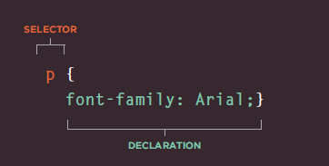
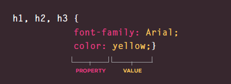
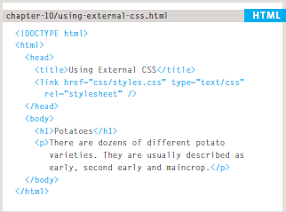
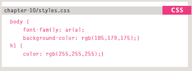

# Introducing to CSS

#### CSS allows you to create rules that specify how the content of an element should appear. For example, you can specify that the background of the page is cream, all paragraphs should appear in gray using the Arial typeface, or that all level one headings should be in a blue, italic, Times typeface.

## Understanding CSS: *(Thinking Insi de the Box)*

##### - The key to understanding how CSS works is to imagine that there is an invisible box around every HTML element.
##### - BLOCK & INLINE ELEMENTS.
##### - CSS allows you to create rules that control the way that each individual box (and the contents of that box) is presented.
##### *Example Styles*

##### - Boxes: Width and height Borders (color, width, and style Background color and images Position in the browser window.
##### - Text: Typeface Size Color Italics, bold, uppercase, lowercase, small-caps.
##### - Specific: There are also specific ways in which you can style certain elements such as lists, tables,and forms. 

### A CSS rule contains two parts: a selector and a declaration :

### CSS declarations sit inside curly brackets and each is made up of two parts: a property and a value, separated by a colon. You can specify several properties in one declaration, each separated by a semi-colon.

### <link> 

##### - The <link> element can be used in an HTML document to tell the browser where to find the CSS file used to style the page. It is an empty element (meaning it does not need a closing tag), and it lives inside the <head> element. It should use three attributes:

**href**

##### - This specifies the path to the CSS file (which is often placed in a folder called css or styles).

**type**

##### - This attribute specifies the type of document being linked to. The value should be text/css.

**rel**

##### - This specifies the relationship between the HTML page and the file it is linked to. The value should be stylesheet when linking to a CSS file.

##### for more information visit [w3schools](https://www.w3schools.com/html/html_css.asp)