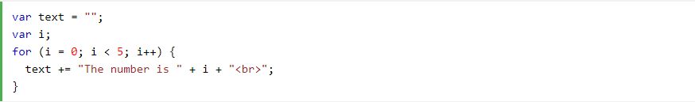
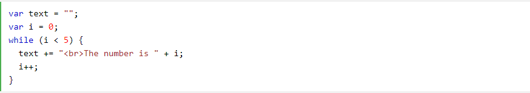

# Comparison Operators

### Comparison operators are used in logical statements to determine equality or difference between variables or values.

#### Given that x = 5, the table below explains the comparison operators:

### Operator	Description	  Comparing	 Returns	Try it

##### - ==	equal to	x == 8	false	
##### - x == 5	true	
##### - x == "5"	true	
##### - ===	equal value and equal type	x === 5	true	
##### - x === "5"	false	
##### - !=	not equal	x != 8	true	
##### - !==	not equal value or not equal type	x !== 5	false	
##### - x !== "5"	true	
##### - x !== 8	true	
##### - >	greater than	x > 8	false	
##### - <	less than	x < 8	true	
##### - >=	greater than or equal to	x >= 8	false	
##### - <=	less than or equal to	x <= 8

## Logical Operators

###Logical operators are used to determine the logic between variables or values.

#### Given that x = 6 and y = 3, the table below explains the logical operators:

#### Operator	Description	Example	Try it

##### - &&	and	(x < 10 && y > 1) is true	
##### - ||	or	(x == 5 || y == 5) is false	
##### - !	not	!(x == y) is true

Definition and Usage
The for statement creates a loop that is executed as long as a condition is true.

### The loop will continue to run as long as the condition is true. It will only stop when the condition becomes false.

#### JavaScript supports different kinds of loops:

##### - for - loops through a block of code a number of times
##### - for/in - loops through the properties of an object
##### - for/of - loops through the values of an iterable object
##### - while - loops through a block of code while a specified condition is true
##### - do/while - loops through a block of code once, and then repeats the loop while a specified condition is true

##### Tip: Use the break statement to break out of a loop, and the [Continue](https://www.w3schools.com/jsref/jsref_continue.asp) statement to skip a value in the loop.

## Definition and Usage

### The while statement creates a loop that is executed while a specified condition is true.

#### The loop will continue to run as long as the condition is true. It will only stop when the condition becomes false.

#### JavaScript supports different kinds of loops:

##### - for - loops through a block of code a number of times
##### - for/in - loops through the properties of an object
##### - for/of - loops through the values of an iterable object
##### - while - loops through a block of code while a specified condition is true
##### - do/while - loops through a block of code once, and then repeats the loop while a specified condition is true

##### Tip: Use the break statement to break out of a loop, and the continue statement to skip a value in the loop.##

